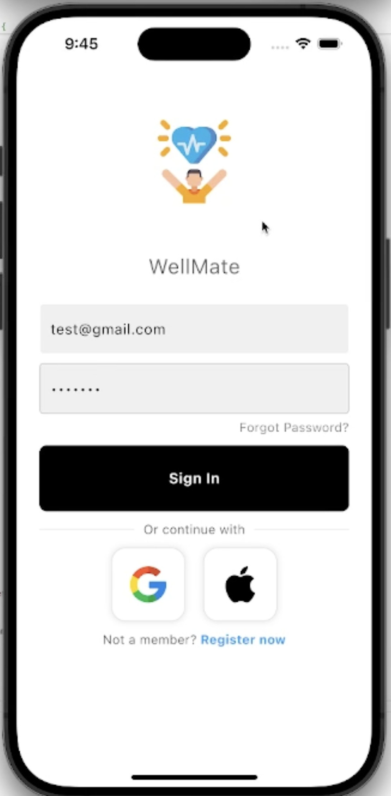

# WellMate - Health & Wellness Mobile App

<div align="center">
  
  
  [](https://flutter.dev/)
  [](https://firebase.google.com/)
  [](https://dart.dev/)
</div>

<div align="center">
  <h3>Key App Screens</h3>
  
  <table>
    <tr>
      <td align="center">
        
        <br><b>🔐 Login Screen</b>
        <br><em>Secure authentication with social login options</em>
      </td>
      <td align="center">
        
        <br><b>🎭 Character Selection</b>
        <br><em>Choose your wellness companion</em>
      </td>
      <td align="center">
        
        <br><b>🏠 Interactive Home</b>
        <br><em>Chat with your character companion</em>
      </td>
    </tr>
    <tr>
      <td align="center">
        
        <br><b>🎯 Goals Management</b>
        <br><em>Track your wellness objectives</em>
      </td>
      <td align="center">
        
        <br><b>📚 Daily Habits</b>
        <br><em>Build healthy daily routines</em>
      </td>
      <td align="center">
        
        <br><b>📅 Activity Calendar</b>
        <br><em>Visualize your progress over time</em>
      </td>
    </tr>
  </table>
</div>


## 📱 Overview

WellMate is a comprehensive health and wellness mobile application built with Flutter that helps users track their fitness goals, build healthy habits, and connect with friends for motivation and support. The app features an engaging character-based interface that guides users through their wellness journey with interactive conversations and progress tracking.

## ✨ Key Features

### 🏠 Interactive Home Screen
- **Animated Character Interface**: Choose from 6 adorable animal characters (panda, lion, pig, monkey, dinosaur, deer)
- **Conversational AI**: Interactive character that provides motivation, goal-setting assistance, and progress summaries
- **Real-time Progress Tracking**: View daily activity, calorie consumption, and weight loss progress
- **Smooth Animations**: Bouncing character with fade transitions for engaging user experience

### 🎯 Smart Goals Management
- **Four Main Categories**: Weight, Healthy Diet, Fitness, and Self Care
- **Pre-defined Sub-goals**: Curated suggestions like "Eat more vegetables," "Exercise daily," etc.
- **Custom Goals**: Create personalized goals for any category
- **Weight Tracking**: Specialized weight loss goals with weekly targets and progress monitoring
- **Visual Progress**: Circular progress indicators showing completion percentage

### 📚 Daily Habits Tracker
- **Default Habits**: Pre-set habits including daily steps (10,000), water intake (8 glasses), exercise (30 minutes), meditation (10 minutes), and homework
- **Custom Habits**: Create and track your own personalized habits
- **Streak Tracking**: Fire emoji indicators showing consecutive days of completion
- **Habit Management**: Hide habits you don't want to track
- **Daily Reset**: Automatic daily reset for fresh starts

### 👥 Social Features
- **Friend Search**: Find other users by display name
- **Friend Management**: Add and manage your friends list
- **Social Motivation**: Connect with friends for mutual support and encouragement

### 👤 Profile Management
- **User Information**: Manage display name, email, and profile picture
- **Character Selection**: Change your animated character anytime
- **Activity Tracking**: View detailed activity and progress data
- **Profile Form**: Update personal attributes (age, weight, height, gender)

## 🛠️ Technical Stack

### Frontend
- **Flutter**: Cross-platform mobile development framework
- **Dart**: Programming language
- **Material Design**: Modern UI components
- **Cupertino Icons**: iOS-style icons

### Backend & Database
- **Firebase Authentication**: Secure user authentication
- **Firebase Realtime Database**: Real-time data synchronization
- **Firebase Core**: Core Firebase services

### Key Dependencies
```yaml
dependencies:
  flutter: sdk
  firebase_core: ^3.12.0
  firebase_auth: ^5.5.0
  firebase_database: ^11.3.5
  provider: ^6.0.0
  sqflite: ^2.0.0+3
  shared_preferences: ^2.5.3
  google_fonts: ^6.2.1
  intl: ^0.18.1
```

## 🚀 Getting Started

### Prerequisites
- Flutter SDK (3.6.2 or later)
- Dart SDK
- Android Studio / Xcode
- Firebase project setup

### Installation

1. **Clone the repository**
   ```bash
   git clone <repository-url>
   cd wellmate/mobile_app
   ```

2. **Install dependencies**
   ```bash
   flutter pub get
   ```

3. **Firebase Setup**
   - Create a Firebase project
   - Enable Authentication and Realtime Database
   - Download `google-services.json` (Android) and `GoogleService-Info.plist` (iOS)
   - Place them in the appropriate directories

4. **Run the app**
   ```bash
   flutter run
   ```

### Platform-Specific Setup

#### iOS Setup
```bash
cd ios
pod install
cd ..
flutter run -d "iPhone 15"
```

#### Android Setup
```bash
flutter run -d "android"
```

## 📱 App Architecture

### Core Components
- **Login/Registration**: Firebase Auth integration
- **Character Selection**: Interactive character picker
- **Home Screen**: Main dashboard with character interface
- **Goals Management**: Comprehensive goal tracking system
- **Habits Tracker**: Daily habit monitoring
- **Friends System**: Social features and user management
- **Profile Management**: User settings and preferences

### Data Flow
- **Firebase Realtime Database**: Stores all user data, goals, habits, and progress
- **Local State Management**: Provider pattern for state management
- **Real-time Synchronization**: Automatic data sync across devices

## 🎨 User Interface

### Design Principles
- **Clean & Modern**: Material Design 3 with custom styling
- **User-Friendly**: Intuitive navigation and clear visual hierarchy
- **Engaging**: Character-based interface with animations
- **Accessible**: High contrast and readable typography

### Key Screens
1. **Login/Register**: Secure authentication with social login options
2. **Character Selection**: Grid-based character picker
3. **Home Dashboard**: Interactive character with conversation flow
4. **Goals**: Expandable cards with progress tracking
5. **Habits**: List-based habit management with streak tracking
6. **Friends**: Search and manage social connections
7. **Profile**: User settings and activity overview

## 📊 Data Tracking

### Health Metrics
- **Weight History**: Track weight changes over time
- **Calorie Management**: BMR/TDEE-based daily calorie goals
- **Activity Tracking**: Steps and calories burned
- **Habit Streaks**: Consecutive completion tracking

### Progress Visualization
- **Circular Progress**: Goal completion percentages
- **Streak Counters**: Fire emoji streak indicators
- **Historical Data**: Weight and activity trends
- **Real-time Updates**: Live progress synchronization

### Key Features Implementation
- **Character Animation**: Custom animation controllers
- **Conversation Flow**: State-based conversation system
- **Data Persistence**: Firebase real-time database
- **State Management**: Provider pattern for reactive UI

## 🚀 Deployment

### Android
```bash
flutter build apk --release
```

### iOS
```bash
flutter build ios --release
```

## 🤝 Contributing

1. Fork the repository
2. Create a feature branch (`git checkout -b feature/amazing-feature`)
3. Commit your changes (`git commit -m 'Add some amazing feature'`)
4. Push to the branch (`git push origin feature/amazing-feature`)
5. Open a Pull Request

## 📄 License

This project is licensed under the MIT License - see the [LICENSE](LICENSE) file for details.

<div align="center">
  <p>Made with ❤️ by the WellMate Team</p>
  <p>© 2024 WellMate. All rights reserved.</p>
</div>
